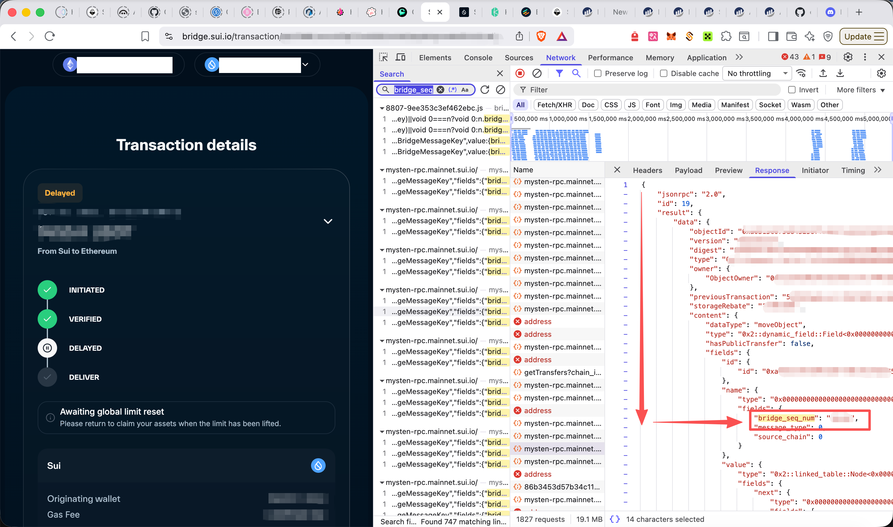

# Sui Bridge FrontRunner

自动抢跑Sui Bridge限额情况。

我本以为是在Sui侧的Limit（如[尝试从sui的object查看](./sui.py)），但实际上是以太坊侧claim时的Limit。

因为被 incrediblez7.eth 给包场了，我本金少gas没法和他竞争就只能干脆给大家开源了。

Automatically frontrun the Sui Bridge limit status.

It was thought to be the Limit on the Sui side (such as [trying to view from Sui's object](./sui.py)), but in fact it is the Limit during claim on the Ethereum side.

## Usage

How to find your tx nonce 
找交易序号方法：

0. Suggest to use uv
1. Install dependencies: `uv pip install -r requirements.txt`
2. Edit the nonce `frontrunner.py` .
3. Run `frontrunner.py` to frontrun.

0. 建议使用uv
1. 安装依赖：`uv pip install -r requirements.txt`
2. 如果想更改阈值，请编辑`frontrunner.py`。
3. 运行`uv run frontrunner.py`来抢跑。

## Disclaimer

This is just a small tool I use to bridge suiUSDT that has been depeg due to MMT & Buidlpad activities from Sui to ETH. I am not responsible for any losses that may occur as a result of using this code.

这只是我用来将由于MMT & Buidlpad活动而脱钩的suiUSDT从Sui跨回ETH的一个小工具。我不对任何由于使用此代码而导致的损失负责。
